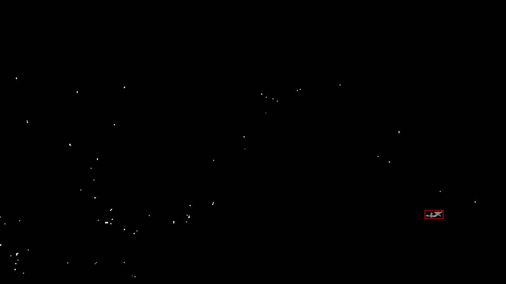

# Lizard monitoring - GraniteCam

## Situation

* Thousands of hours of timelapse video of granite outcrops, with sparse lizard actvity
* Objective: detect all of the lizards

## Plan

1. Tune the BGS model to produce useful looking output from the labelled videos in the training set

"))
2. Draw bounding boxes around each frame for each lizard

3. Mask the BGS output with these bounding boxes, forming the required output of the training set with the RGB video as the input

4. Increase the size of the training set by augmenting using salt and pepper, cropping and resizing, flipping through the y axis, etc.

5. Train a CNN on the training set

6. Validate on the validation set

## TODO
* Confirm understanding with Ashwin